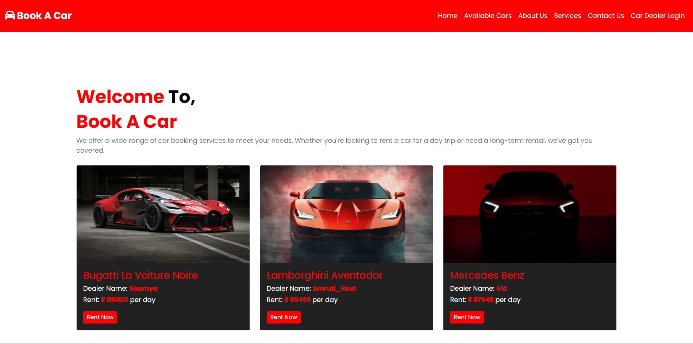
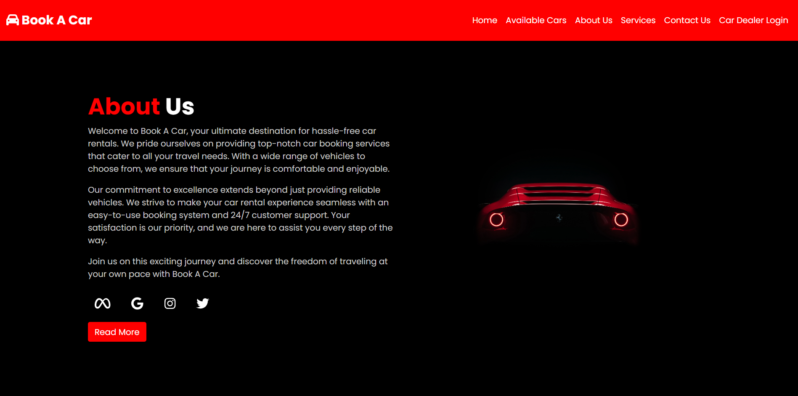
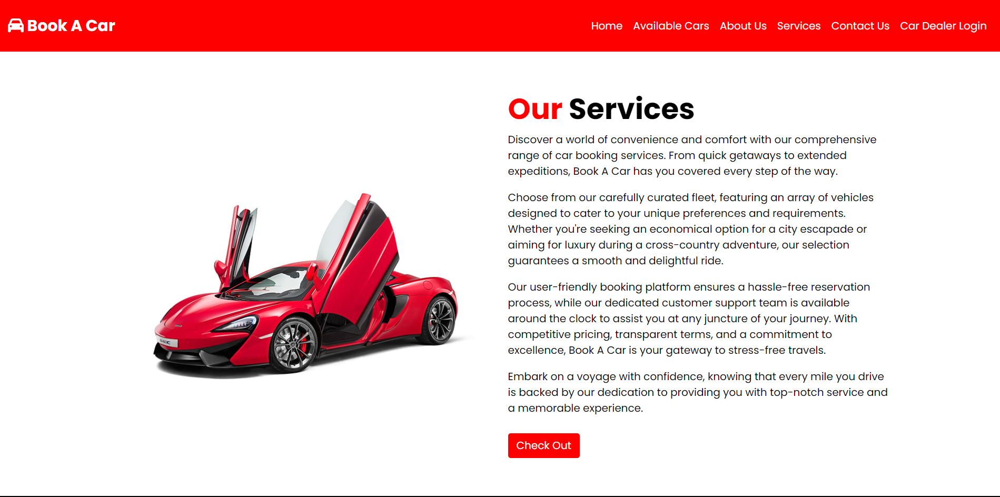
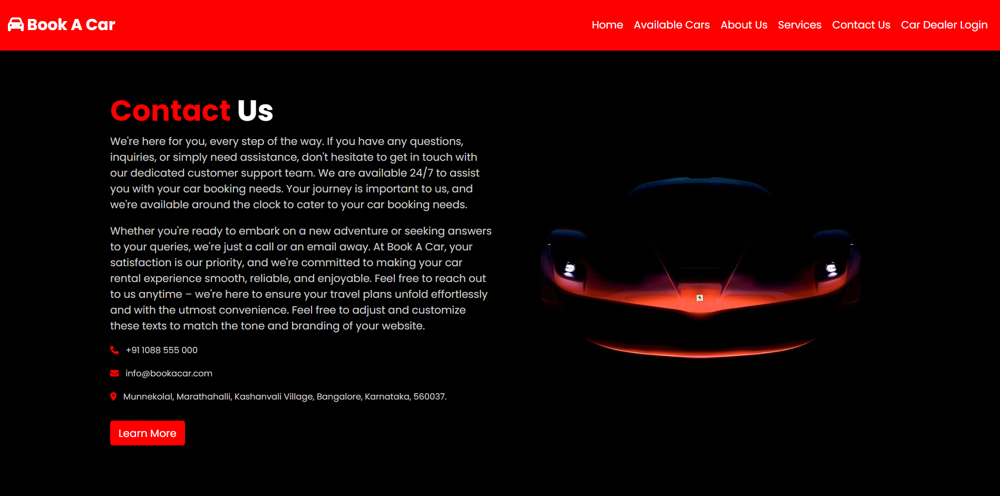
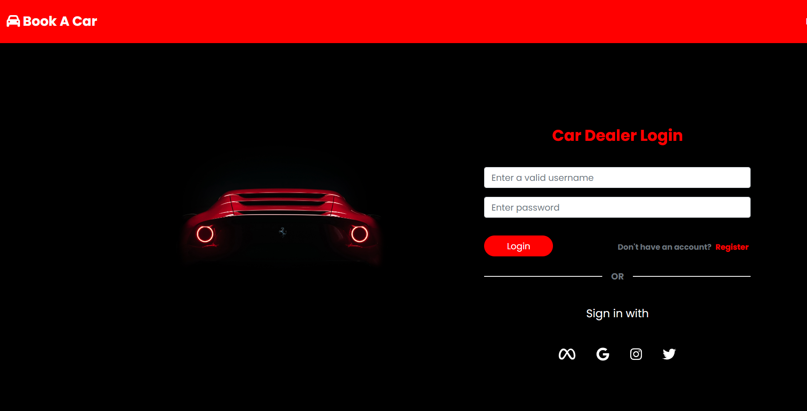
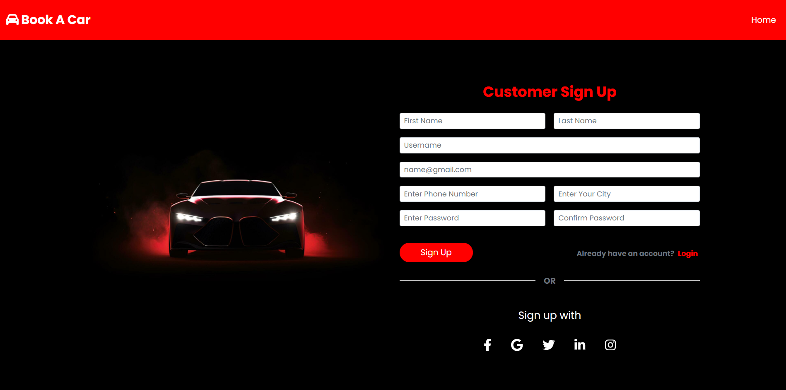
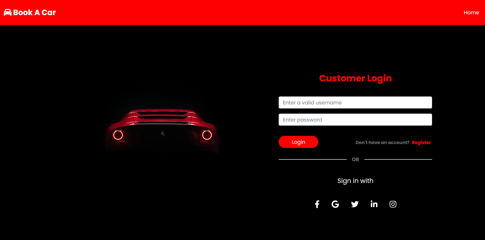

## Table of Contents

* [Features](#features)
* [Installations](#installations)
* [Usage](#usage)
* [Authentication](#authentication)
* [Contributing](#contributing)
* [License](#license)
* [Website Images](#websiteimages)

### Features

* Location wise availability of Cars.
* Admin Handling lnterface.
* Secure payment system and Bill Generation.
* User Authentication.
* Responsive Design for all devices.

### Installations

1. Clone the repository:

   ```shell
   git clone https://github.com/study-soumya/Book-A-Car
   cd Book-A-Car
   ```
2. Make Virtual Environment:

   ```shell
   python -m venv env
   ```
3. Activate Environment

   ```shell
   Windows: ./env/Scripts/activate
   Bash: source env/Scripts/activate
   ```
4. Install the required Python packages:

```shell
   pip install -r requirements.txt
```

4. Configure the database settings in `CarBookingSystem/settings.py`.
5. Apply migrations:

   ```shell
   python manage.py makemigrations
   python manage.py migrate
   ```
6. Create a superuser for admin access:

   ```shell
   python manage.py createsuperuser
   ```
7. Run the development server:

   ```shell
   python manage.py runserver
   ```

### Usage

#### Admin Access

1. Access the admin panel at `http://localhost:8000/admin/` and log in with the superuser credentials created in step 5 of the installation.
2. Use the admin panel to add data like cars, car dealer details, customer details and more.

#### User Access

1. Car Dealer can add Cars and it's details like Price, Location, and address.
2. Customer can check a Car and its location, address, price, Car Dealer Name, and payment bill.

### Authentication

* Both Car Dealer and Customer are authenticated by Django's built-in User Authentication method.

### Contributing

Contributions to this project are welcome. If you'd like to make improvements, please follow these steps:

1. Fork the repository.
2. Create a new branch for your feature or bug fix.
3. Make your changes and submit a pull request.

Please ensure your code follows best practices and includes appropriate tests.

### License

This project is licensed under the MIT License - see the [LICENSE](LICENSE) file for details.

### Watch Live: [Book A Car](https://soumyapatra.pythonanywhere.com/)

### Website Images


